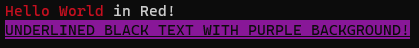

 

--------

# EasyCL
 a simple and easy to use C/C++ library to print colored and styled text, control console cursor and much more in windows and linux.

---------
## Documentation
Documentation can be found in [**doc/EasyCLI.md**](doc/EasyCLI.md) file.

---------
### a simple example

download the latest release, include the header file and link to the library at compile time.
the following code is a simple example of using EasyCLI.

```c
// main.c
#include "EasyCLI.h"

int main(void){
#ifdef _WIN32
    EC_ConsoleEnableVTMode(); // enable Virtual Terminal in windows
#endif

    EC_PrintColored("{R}Hello World{0} in Red!\n");

    EC_SetColorMode(EC_COLORMODE_Enabled);
    EC_Print("{_B}{#M}UNDERLINED BLACK TEXT WITH PURPLE BACKGROUND!{0}\n");

#ifdef _WIN32
    EC_ConsoleResetMode(); // turn console back to its previous mode.
#endif
}
```
**Compiling :**
```c
gcc main.c libEasyCLI.a // STATIC Linking
// or
gcc main.c libEasyCLI.so // Shared Linking in linux
//or
gcc main.c libEasyCLI.dll // Shared Linking in windows
```
**output :**<br>


---------

### How it Works
EasyCLI uses ANSI escape sequences which most modern terminals support. for example `ESC[ n m` which changes the color of text in front of it.

all of the sequences used in EasyCLI are taken from the following sources :
**[Wikipedia](https://en.wikipedia.org/wiki/ANSI_escape_code)<br>
[Microsoft Docs](https://docs.microsoft.com/en-us/windows/console/console-virtual-terminal-sequences)<br>
[XTerm Control Sequences](https://invisible-island.net/xterm/ctlseqs/ctlseqs.html)**
